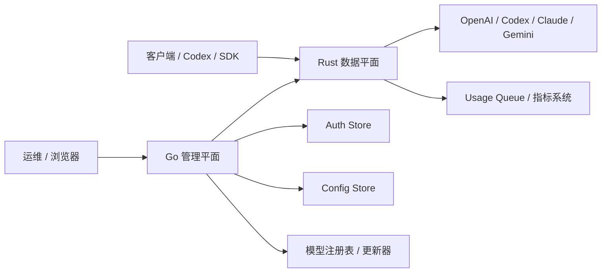
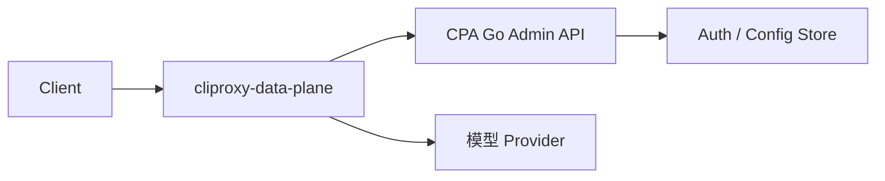

# CPA 管理平面与数据平面设计

## 1. 文档目标

本文档用于把当前 CLIProxyAPI（CPA）拆分为两部分：

- **管理平面（Control Plane）**：负责配置、凭证生命周期、管理后台、后台维护任务
- **数据平面（Data Plane）**：负责请求接入、路由、上游执行、协议转换、流式处理、用量投递

`cliproxy-data-plane` 的近期目标不是把 CPA 整体重写一遍，而是先把 **最热、最适合系统语言承载的请求路径** 从 Go 中抽出来，用 Rust 重建，同时保留现有 Go 管理平面。

本文重点聚焦首批最值得 Rust 化的 4 块：

1. 流量接入与 SSE 转发
2. 上游执行运行时
3. 带会话粘性的路由与鉴权选择
4. 高频协议转换

## 2. 当前 CPA 的平面划分

### 2.1 管理平面

CPA 中以下模块主要属于管理平面：

- 服务启动与进程生命周期：`cmd/server/`、`internal/cmd/`
- 配置解析与运行时配置状态：`internal/config/`
- 管理后台与管理接口：`internal/api/handlers/management/`、`internal/managementasset/`
- OAuth 登录与令牌获取：`internal/auth/`
- 配置与 auth 热更新：`internal/watcher/`
- 模型元数据更新：`internal/registry/model_updater.go`、`internal/misc/antigravity_version.go`
- 凭证持久化与存储后端：`sdk/auth/filestore.go`、`internal/store/`
- 插件宿主与管理集成：`internal/pluginhost/`
- TUI 与 standalone 交互：`internal/tui/`

这部分的典型特征：

- QPS 远低于请求主链路
- 面向运维和管理者
- 状态型流程较多
- 更关注正确性、可维护性、可操作性

### 2.2 数据平面

CPA 中以下模块主要属于数据平面：

- 对外 API 接入：`sdk/api/handlers/openai/`、`sdk/api/handlers/claude/`、`sdk/api/handlers/gemini/`
- 通用请求执行流程：`sdk/api/handlers/handlers.go`
- auth 选择与调度：`sdk/cliproxy/auth/conductor.go`、`sdk/cliproxy/auth/scheduler.go`、`sdk/cliproxy/auth/selector.go`
- 上游 provider 执行器：`internal/runtime/executor/`
- 协议转换：`internal/translator/`
- WebSocket relay：`internal/wsrelay/`
- usage 记账与 usage queue 投递：`sdk/cliproxy/usage/manager.go`、`internal/redisqueue/`
- 热路径上的请求/会话缓存：`internal/cache/`、`internal/runtime/executor/helps/`

这部分的典型特征：

- 每个业务请求都会经过
- 延迟敏感
- 分配与拷贝敏感
- 经常处理长连接和流式输出
- 失败重试、路由切换会直接影响用户可见行为

## 3. 总体演进方向

### 3.1 目标形态

CPA 后续可以演进为：

- **Go 管理平面**
  - 配置管理
  - 管理后台
  - OAuth 登录
  - 凭证存储
  - watcher
  - 后台更新任务
- **Rust 数据平面**
  - 请求接入
  - 流式转发
  - 会话路由
  - 上游执行
  - 协议转换
  - usage 事件输出

### 3.2 接入原则

首期 Rust 化建议走 **sidecar / 独立服务边界**，而不是进程内 FFI。

原因：

- 故障隔离更清晰
- 发布节奏可以独立
- 观测边界更明确
- 避免 CGO/FFI 带来的复杂性
- 性能压测、灰度、回滚都更容易做

推荐的整体关系是：

- Go 继续作为配置和 auth 状态的事实来源
- Go 向 Rust 下发规范化的运行时快照
- Rust 承担高吞吐请求主链路
- Go 的管理接口继续负责写操作

## 4. 高层平面边界



## 5. 为什么先做这 4 块

这 4 块几乎覆盖了请求热路径中最核心的部分：

- 所有请求都会先进入 API handler
- 最重的请求通常都是流式请求
- 真正开始执行前一定会经过路由和重试选择
- 请求和响应两端通常都要做协议转换

同时，这 4 块和 OAuth、管理后台相比，边界更清晰，更适合先拆。

## 6. Rust 目标一：流量接入与 SSE 转发

### 6.1 当前 CPA 中的映射

主要对应的 Go 代码位置：

- `sdk/api/handlers/openai/openai_responses_handlers.go`
- `sdk/api/handlers/openai/openai_handlers.go`
- `sdk/api/handlers/stream_forwarder.go`
- `sdk/api/handlers/handlers.go`

当前这条链路承担的行为包括：

- 接收 OpenAI 兼容请求
- 判断 `stream=true`
- 保持下游 SSE 连接
- 调用 auth manager 发起执行
- 在真正提交下游响应头前先探测第一批上游结果
- 按 chunk 增量转发并 flush
- 修复不完整或不规范的 Responses SSE 帧
- 保留 usage 与终止事件

### 6.2 为什么适合 Rust

这条路径的特征是：

- 高并发
- buffer 处理很多
- 对半包、拼帧、边界处理很敏感
- 很容易因为多次分配和拷贝拉高成本
- 对背压和 flush 时机要求比较高

Rust 基于 `tokio` + `hyper`/`axum` 做这类长流式输出，通常更适合做高并发、低分配的实现。

### 6.3 建议的 Rust 模块

模块名建议：

- `crates/dataplane-ingress`

职责：

- 提供 `/v1/chat/completions`、`/v1/responses`、`/v1/messages` 的 HTTP 接入
- 提供 SSE 输出写回
- 负责首包提交前的 bootstrap 缓冲
- 负责帧解析与归一化
- 负责流控和下游 flush 策略
- 提取请求元数据

不负责：

- 配置编辑
- OAuth 登录
- auth 持久化
- 管理后台页面

### 6.4 内部子组件建议

- `http_router`
  - 路由匹配
  - 请求解析
- `stream_bootstrap`
  - 首字节下发前的结果探测
- `sse_framer`
  - 帧边界识别
  - `data:` 提取
  - 收尾 flush
- `sse_repair`
  - 在 `response.completed` 缺少完整 output 时，根据之前的 item 事件补齐
- `downstream_writer`
  - chunk 写回
  - 断连处理
  - keepalive 支持

### 6.5 与 Go 的接口

Go 至少需要向 Rust 提供这样一份最小运行时快照：

```json
{
  "listeners": {
    "public_http": ":8317"
  },
  "routing": {
    "strategy": "fill-first",
    "session_affinity": true,
    "session_ttl_seconds": 3600
  },
  "models": {},
  "auth_pool": []
}
```

Go 向 Rust 发布快照的方式可以是：

1. 本地 Unix socket 管理接口
2. 本地 loopback HTTP 管理接口
3. 带版本号的文件快照

首期建议：

- 采用 **本地 loopback HTTP 管理接口 + 带版本号的全量快照拉取**

### 6.6 迁移建议

第一阶段：

- Rust 只先接管 `/v1/responses`
- 其他路由仍然走 Go

第二阶段：

- Rust 接管 `/v1/chat/completions` 和 `/v1/messages`

第三阶段：

- Rust 成为主要的对外推理入口

## 7. Rust 目标二：上游执行运行时

### 7.1 当前 CPA 中的映射

主要对应的 Go 代码位置：

- `internal/runtime/executor/codex_executor.go`
- `internal/runtime/executor/claude_executor.go`
- `internal/runtime/executor/gemini_executor.go`
- `internal/runtime/executor/openai_compat_executor.go`
- `internal/runtime/executor/codex_websockets_executor.go`

当前承担的行为包括：

- 构造上游请求
- 注入 auth 和 provider 特定 header
- 维持长连接 SSE 或 WebSocket 会话
- 增量读取上游流
- 判断是否可重试
- 提取 usage 和 provider 元数据
- 处理 provider 兼容性补丁

### 7.2 为什么适合 Rust

这层本质上是网络运行时核心：

- 并发 socket 多
- 读写事件密集
- 超时策略需要严格控制
- 流生命周期管理复杂
- SSE 与 WebSocket 并存

Rust 很适合做成一个边界明确、资源开销可控的异步执行引擎。

### 7.3 建议的 Rust 模块

模块名建议：

- `crates/upstream-runtime`

职责：

- 提供 OpenAI/Codex/Claude/Gemini 的 provider adapter
- 提供上游 HTTP client pool
- 在需要时提供 WebSocket session pool
- 负责重试分类
- 负责上游流解码
- 向 ingress 层输出统一的事件流

核心抽象建议：

```text
ExecutorRequest -> ProviderAdapter -> UpstreamEventStream -> NormalizedChunkStream
```

### 7.4 内部子组件建议

- `provider_openai`
- `provider_codex`
- `provider_claude`
- `provider_gemini`
- `stream_decoder_sse`
- `stream_decoder_ws`
- `retry_classifier`
- `auth_injector`
- `usage_extractor`

### 7.5 统一事件模型

建议先把不同 provider 的返回统一成一个内部事件模型：

```rust
enum StreamEvent {
    Headers(ResponseHead),
    Data(Bytes),
    Usage(UsageRecord),
    Terminal(TerminalState),
    Error(StreamError),
}
```

这样 provider 差异就被限制在执行器内部，而不是泄漏到所有上层逻辑。

### 7.6 迁移建议

不要一次性迁所有 executor。

建议顺序：

1. OpenAI Responses executor
2. Codex executor
3. Claude executor
4. Gemini executor
5. WebSocket 特殊路径

## 8. Rust 目标三：带会话粘性的路由与鉴权选择

### 8.1 当前 CPA 中的映射

主要对应的 Go 代码位置：

- `sdk/cliproxy/auth/conductor.go`
- `sdk/cliproxy/auth/scheduler.go`
- `sdk/cliproxy/auth/selector.go`
- `sdk/cliproxy/auth/session_cache.go`

当前承担的行为包括：

- 按 provider/model 选择候选 auth
- Fill First / Round Robin 策略
- priority 分层
- session affinity
- 配额或限流后的 cooldown
- auth 刷新决策
- 故障后切换其他 credential

### 8.2 为什么适合 Rust

这不只是普通业务逻辑，而是直接影响：

- 请求延迟
- 缓存命中率
- 会话粘性质量
- 重试风暴规模
- 部分账号退化时的整体成功率

这部分很适合用明确状态机和紧凑内存结构重写。

### 8.3 建议的 Rust 模块

模块名建议：

- `crates/router-core`

职责：

- 基于 Go 下发的快照维护运行时索引
- 评估 provider/model/auth 候选
- 维护 session affinity 映射
- 维护 cooldown 和健康状态
- 为每个请求输出一份执行计划

不负责：

- 首期不直接获取或刷新 OAuth token
- 首期不直接做 auth 持久化

### 8.4 核心数据结构建议

- `AuthRecord`
  - id
  - provider
  - 支持的模型集合
  - priority
  - free/paid 标识
  - cooldown 状态
  - 能力标签
- `ModelRouteIndex`
  - provider+model -> 候选列表
- `SessionAffinityMap`
  - session key -> auth id + TTL
- `SchedulerState`
  - round-robin offset
  - 健康状态
  - 失败计数

### 8.5 选择结果

selector 不应该直接执行请求，而应该返回一份计划：

```rust
struct ExecutionPlan {
    provider: ProviderKind,
    model: String,
    auth_id: String,
    retry_candidates: Vec<String>,
    stickiness_source: StickinessSource,
}
```

### 8.6 需要保留的关键语义

- priority 是层级，不是权重
- round-robin 只在当前最高可用 priority 层内轮转
- fill-first 会持续使用首个可用候选，直到其不可用
- session affinity 命中时应优先覆盖常规轮转
- 一旦已经向下游发过字节，后续不能随意静默换 auth，除非策略明确允许

### 8.7 迁移建议

第一阶段：

- Rust router 消费 Go 提供的全量快照
- Go 继续负责 auth 刷新和持久化

第二阶段：

- Rust 向 Go 回传状态变化信号，比如 cooldown、auth unhealthy

第三阶段：

- 可以把部分 refresh hint 下沉到 Rust，但 OAuth 生命周期仍应由 Go 主控

## 9. Rust 目标四：高频协议转换

### 9.1 当前 CPA 中的映射

主要对应的 Go 代码位置：

- `internal/translator/`
- `sdk/translator/`

高价值路径包括：

- OpenAI Responses <-> Codex
- OpenAI Chat Completions <-> provider 原生格式
- Claude <-> OpenAI 兼容
- Gemini <-> OpenAI 兼容

### 9.2 为什么适合 Rust

这层会反复进行：

- JSON 字段投影
- payload 重组
- 流式事件映射
- usage 字段转换
- provider 兼容性修补

如果把它做成纯转换库，Rust 很适合作为一个高频、低分配的变换层。

### 9.3 建议的 Rust 模块

模块名建议：

- `crates/protocol-translate`

职责：

- 把客户端规范请求转换为 provider 特定请求
- 把 provider 的响应/事件转换回 CPA 兼容输出
- 保留 usage 语义
- 保留 tool call 和 reasoning 语义

推荐设计：

- 一个统一的中间表示（IR）
- ingress 和 egress 两端分别做 provider adapter

### 9.4 内部分层建议

- `ir`
  - 规范化请求/响应/事件类型
- `openai_responses`
  - 解析与输出
- `openai_chat`
  - 解析与输出
- `claude_adapter`
- `gemini_adapter`
- `codex_adapter`

### 9.5 一个典型转换链

```text
OpenAI Responses request
-> canonical IR
-> Codex upstream request
-> Codex upstream SSE events
-> canonical stream events
-> OpenAI Responses SSE output
```

### 9.6 迁移建议

这块要小心，因为 CPA 当前的协议知识分散在：

- handler
- executor
- translator

Rust 版本不应照搬这种分散结构，而应该以 IR 为中心，把协议变换收敛起来。

## 10. Rust Workspace 目录建议

```text
cliproxy-data-plane/
  docs/
    cpa-control-plane-and-data-plane-design.md
  crates/
    dataplane-ingress/
    upstream-runtime/
    router-core/
    protocol-translate/
    usage-events/
    runtime-config-client/
    common-types/
  src/
    main.rs
```

各模块建议职责：

- `src/main.rs`
  - 二进制入口
  - 初始化 runtime snapshot client
  - 启动对外监听
- `common-types`
  - 各 crate 共享的结构体和枚举
- `runtime-config-client`
  - 从 Go 拉取并应用快照
- `usage-events`
  - 把 usage 记录投递到 queue 或指标系统

## 11. 管理平面与数据平面的契约

Go 与 Rust 之间应该有一份明确、可版本化的契约。

### 11.1 Go 提供给 Rust 的内容

- listener 配置
- 启用的路由
- provider 注册表
- model alias 表
- auth 记录
- 路由策略
- session affinity 配置
- usage queue 配置
- feature flag

### 11.2 Rust 回传给 Go 的内容

- 请求指标
- 流指标
- auth 健康信号
- cooldown 建议
- usage 事件
- 严重 provider adapter 错误

### 11.3 快照版本化

每份快照都应该带上：

- `version`
- `generated_at`
- `source_instance_id`

Rust 应该原子化应用快照。已经在途的请求继续使用旧快照完成，不应被中途切换打断。

## 12. 部署形态

### 12.1 第一阶段部署

- Go CPA 继续监听管理端口和内部管理接口
- Rust 数据平面监听对外推理端口
- Rust 启动后从 Go 拉取快照，并定期刷新



### 12.2 故障模型

如果 Rust 无法刷新配置快照：

- 继续用最后一份可用快照服务
- 对外暴露 degraded 健康状态
- 只有在从未成功加载过快照时才 fail closed

如果 Go 管理平面不可用：

- 只要现有 auth 仍有效，业务流量可继续跑一段时间
- 但管理写操作会不可用

## 13. 可观测性

Rust 数据平面建议暴露以下指标：

- 按 route/provider/model 统计的请求数
- 流式会话时长
- 首字节延迟
- 上游连接延迟
- bootstrap 重试次数
- auth 选择分布
- session affinity 命中率
- SSE 修复次数
- 协议转换失败次数
- usage 事件投递延迟

日志中必须避免泄漏：

- bearer token
- OAuth refresh token
- management key
- 原始用户 prompt（除非显式开启调试）

## 14. 首期 Rust 化的非目标

首期不建议碰这些：

- 管理后台重写
- OAuth 浏览器登录流程重写
- auth 持久化重写
- plugin host 重写
- TUI 重写
- model updater 重写
- 第一天就追求所有 provider 和路由全量对齐

## 15. 推荐实施顺序

### 阶段 A

- 定义 runtime snapshot 契约
- 搭建 Rust ingress 骨架
- 先落 `/v1/responses` 流式链路

### 阶段 B

- 补 OpenAI/Codex 上游执行运行时
- 补 router-core，先实现 fill-first 和 session affinity

### 阶段 C

- 抽协议 IR 和 translator
- 落 usage 事件输出

### 阶段 D

- 扩展 Claude/Gemini
- 扩展 WebSocket relay

## 16. 结论

当前最合理的近中期架构是：

- 继续让 **Go 承担管理平面**
- 让 **Rust 以 sidecar 形式承接数据平面**
- 优先迁移 **请求热路径**

首批最值得 Rust 化的 4 个目标应当是：

1. 接入层与 SSE 转发
2. 上游执行运行时
3. 路由与会话粘性 auth 选择
4. 协议转换层

这样既能保留 CPA 在管理、OAuth、配置灵活性上的现有优势，又能把最吃性能、最依赖流式稳定性、最容易在高并发下暴露问题的链路下沉到更适合的系统层。
