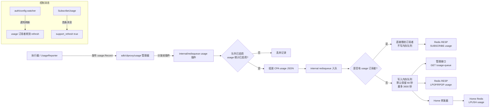
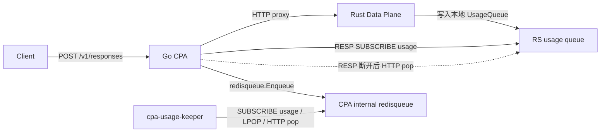
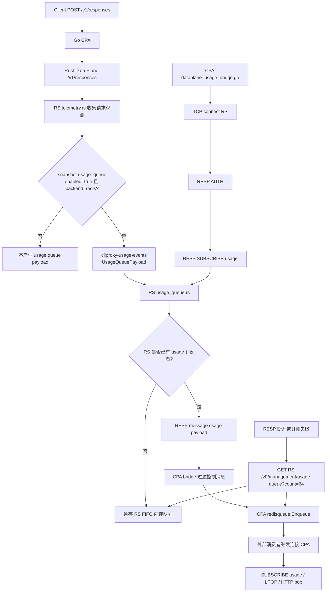

# CPA 用量流程与 RS 差距

## 1. 文档目标

本文档记录 CPA 当前 usage 事件的真实生产、队列和消费链路，并说明 Rust 数据平面当前与 CPA 的差距。

当前事实来源：

- CPA usage 生产：`internal/runtime/executor/helps/usage_helpers.go`
- CPA usage manager：`sdk/cliproxy/usage/manager.go`
- CPA queue payload：`internal/redisqueue/plugin.go`
- CPA queue / subscriber：`internal/redisqueue/queue.go`
- CPA Redis RESP 兼容协议：`internal/api/redis_queue_protocol.go`
- CPA HTTP usage queue：`internal/api/handlers/management/usage.go`
- RS usage producer：`rust/cliproxy-data-plane/src/telemetry.rs`
- RS usage payload：`rust/cliproxy-data-plane/crates/usage-events/src/lib.rs`
- RS usage queue：`rust/cliproxy-data-plane/src/usage_queue.rs`
- RS Redis RESP 兼容协议：`rust/cliproxy-data-plane/src/redis_protocol.rs`
- CPA -> RS usage bridge：`internal/api/dataplane_usage_bridge.go`

## 2. RS usage 模块职责边界

RS 侧 usage 现在按“事件模型 -> 请求观测 -> 本地队列 -> 协议出口 -> CPA 回填”分层：

| 模块 | 职责 | 不负责 |
| --- | --- | --- |
| `crates/usage-events` | 定义 CPA-shaped `UsageQueuePayload`、`UsageQueueTokens`、`UsageQueueFail`，并提供非阻塞 `UsageEventProducer` | 不处理 Redis RESP、HTTP pop、订阅者管理，也不直接决定消费链路 |
| `src/telemetry.rs` | 在 `/v1/responses` 请求生命周期中收集 provider、auth、model、headers、usage token、TTFT、latency，并组装 `UsageQueuePayload` | 不暴露消费协议，不保存队列 |
| `src/usage_queue.rs` | 提供 RS 进程内 usage queue、subscriber fan-out、`support_refresh` / `refresh` 控制消息和 FIFO pop 语义 | 不是完整 Redis server，不做外部网络协议解析 |
| `src/redis_protocol.rs` | 把 `UsageQueue` 暴露成 CPA 兼容 Redis-like RESP 协议，支持 `AUTH`、`SUBSCRIBE usage/errors`、`LPOP/RPOP usage` | 不生成 usage payload，不实现完整 Redis 命令集 |
| `src/http.rs` | 暴露 RS 管理面 HTTP pop：`GET /v0/management/usage-queue?count=N` | 不负责 CPA 外部消费者无感迁移 |
| `internal/api/dataplane_usage_bridge.go` | CPA 后台 bridge，优先通过 RESP `SUBSCRIBE usage` 订阅 RS usage，并回填 CPA `internal/redisqueue` | 不改变外部 keeper 的连接入口 |

因此，`cliproxy-usage-events` 是事件数据模型层；`redis_protocol.rs` 和 `usage_queue.rs` 才是当前 usage 消费路径依赖的协议与队列层。

## 3. CPA 当前 usage 主流程



## 4. CPA 真实协议表

| 层 | CPA 当前实现 | 真实协议 / 行为 | 关键事实 |
| --- | --- | --- | --- |
| 生产入口 | executor 调 `usage.PublishRecord(ctx, record)` | Go 进程内异步 manager 分发 | 不是直接写 Redis，先进入 `sdk/cliproxy/usage`。 |
| payload 形状 | `internal/redisqueue/usageQueuePlugin` 组装 JSON | 字段包括 `timestamp`、`latency_ms`、`ttft_ms`、`source`、`auth_index`、`tokens`、`failed`、`fail`、`response_headers`、`provider`、`executor_type`、`model`、`alias`、`endpoint`、`auth_type`、`api_key`、`request_id`、`reasoning_effort`、`service_tier` | 这是 CPA usage queue 的事实 payload。 |
| 启用开关 | `redisqueue.Enabled()` 且 `UsageStatisticsEnabled()` | 两个开关都满足才投递 | `usage-statistics-enabled` 控制统计开关，管理面和 home 模式还会影响 queue 总开关。 |
| 队列存储 | `internal/redisqueue` 进程内内存队列 | 默认保留 60 秒，最大 3600 秒 | 不是外部 Redis list 持久队列。 |
| 广播优先级 | `Enqueue()` 先 `publishToSubscribers`，无订阅者才入队 | 有订阅者时消息不落内存队列 | 订阅消费是实时路径，HTTP / LPOP 是队列兜底路径。 |
| 刷新协议 | `SubscribeUsage()` 首包发 `support_refresh true`，`NotifyUsageRefresh()` 发 `refresh true` | usage 通道包含控制消息 | 消费端需要识别并处理控制消息。 |
| 管理面拉取 | `GET /v0/management/usage-queue?count=N` | HTTP JSON 数组，内部 `PopOldest(N)` | 一次 pop 就消费掉。 |
| Redis RESP 兼容出口 | `AUTH` 后支持 `SUBSCRIBE usage/errors`、`LPOP usage [count]`、`RPOP usage [count]` | 本地 Redis-like 协议，不是完整 Redis server | `errors` 只支持订阅，不支持 pop。 |
| Home 模式出口 | 轮询 `PopOldest(64)`，逐条 `LPUSH usage` 到 home | Home 模式下本地 RESP usage 输出被禁用 | 这是 CPA 里明确使用真实 Redis 命令的出口。 |
| 失败处理 | Home `LPUSH` 失败后把剩余 item 重新 `Enqueue` | 最小重入队重试 | 不提供严格持久化保证。 |

## 5. Keeper 消费方式

`cpa-usage-keeper` 的实际消费优先级是：

1. Redis RESP：`AUTH` + `SUBSCRIBE usage`
2. 如果订阅不可用，再 Redis RESP：`LPOP usage`，并兼容旧 key `queue`
3. 如果 Redis pull 也不可用，最后降级到 HTTP：`GET /v0/management/usage-queue`

典型 Docker Compose 中：

```yaml
CPA_BASE_URL: http://cli-proxy-api:8317
REDIS_QUEUE_ADDR: cli-proxy-api:8317
```

含义是：

- `CPA_BASE_URL` 用于普通 HTTP 管理接口。
- `REDIS_QUEUE_ADDR` 用于 CPA 暴露的 Redis RESP usage stream。

因此，Keeper 稳定运行时通常是长期订阅 `usage`，不是优先轮询 `GET /usage-queue`。

## 6. 外部无感消费链路

当 Go CPA 配置了 Rust 数据平面并开启 usage 统计后，外部消费者不需要改成直连 RS：



更完整的顺序链路如下：



关键语义：

- `cpa-usage-keeper` 仍然连 CPA 的 `REDIS_QUEUE_ADDR`。
- CPA 后台 bridge 优先用 Redis RESP `AUTH` + `SUBSCRIBE usage` 订阅 RS usage。
- 收到的 payload 原样写回 CPA `internal/redisqueue`。
- 如果 RESP 订阅不可用或断开，CPA 会先从 RS `/v0/management/usage-queue?count=64` 做一次 HTTP pop 兜底，然后延迟重连 RESP。
- 如果 Keeper 正在订阅 CPA `usage`，记录会按 CPA 原有语义直接广播；没有订阅者时才进入 CPA 内存队列。
- RS 和 CPA 的 queue 都遵循“有订阅者优先广播，不落内存队列”的语义；这可以避免 RESP 主路径和 HTTP/LPOP 兜底路径重复消费同一条记录。
- RS RESP `AUTH` 在配置了 `snapshot_bearer_token` 时校验该 token；当前 CPA bridge 使用 `s.localPassword` 作为 AUTH password。嵌入式场景预期可对齐，外置 RS 独立鉴权配置仍为 `待确认`。

## 7. RS 当前差距

| 维度 | CPA 现状 | RS 当前 | 差距结论 | 影响 / 备注 |
| --- | --- | --- | --- | --- |
| 生产入口 | 全局 usage manager + plugin 分发 | `/v1/responses` telemetry 直接收口发 payload | RS 只有垂直链路内 producer，没有对齐 CPA 的 manager / plugin 层。 | 当前可覆盖 RS 承接的 `/v1/responses`；如果后续 RS 承接更多接口，需要抽象更通用的 usage 管道。 |
| payload 形状 | 已定型，见 `queuedUsageDetail` | 基本对齐 `UsageQueuePayload` | 形状接近，但 `source`、`api_key`、`reasoning_effort` 等字段仍有默认值或缺口。 | 统计主字段可用；依赖这些细粒度字段的报表可能不完全等价。 |
| 启用条件 | `redisqueue.Enabled && usage-statistics-enabled` | Go snapshot 已导出 `usage_queue.enabled/backend`，RS 只在 `enabled=true && backend=redis` 时投递 | 已补最小对齐；更细的 home/management 运行时切换仍需端到端验证。 | 切换配置时需要确认 bridge 与 snapshot 刷新时序。 |
| snapshot 配置来源 | Go 真实运行时是配置事实源 | Go exporter 已根据 management/home 与 `usage-statistics-enabled` 导出 `usage_queue` | 最小链路已联通。 | Go 仍是事实源，RS 不应自己推导开关。 |
| 队列实现 | 进程内内存队列 + subscriber 语义 | RS 已实现本地 `UsageQueue`，支持 FIFO pop 和 subscriber fan-out | 最小语义已对齐。 | 与 CPA 一样不是持久化队列。 |
| 广播优先队列 | 有订阅者则不入队 | 已支持 | 最小语义已对齐。 | 避免主订阅路径和 pop 兜底重复消费。 |
| refresh 控制消息 | `support_refresh` / `refresh` | 已支持 `support_refresh` 首包和 `refresh` 广播能力 | 最小语义已对齐。 | CPA bridge 会过滤控制消息，不写回 CPA usage payload 队列。 |
| 管理面 HTTP pop | `GET /usage-queue` | 已支持 `/v0/management/usage-queue?count=N`；CPA bridge 在 RESP 不可用时会用该接口兜底 | 外部消费者可继续从 CPA 读取。 | HTTP pop 是断线兜底，不是稳定主路径。 |
| Redis RESP 兼容协议 | `AUTH`、`SUBSCRIBE usage/errors`、`LPOP/RPOP usage` | 已支持同端口 RESP 分流和最小命令集；CPA bridge 优先 `SUBSCRIBE usage`；配置了 `snapshot_bearer_token` 时会校验 AUTH 密码 | 最小语义已对齐；不是完整 Redis server。 | 外置 RS 独立鉴权配置仍为 `待确认`。 |
| Home 模式真实转发 | `LPUSH usage` 到 home | 不支持 | RS 缺失。 | Home 模式如需要由 RS 直接转发 usage，还要补独立链路。 |
| 错误事件通道 | `errors` channel 单独订阅 | 已支持订阅通道，但 RS 侧错误 payload 生产仍未接入 | 消费协议已补，生产来源仍缺。 | 当前不能认为 RS 已完整复刻 CPA errors channel。 |
| 覆盖范围 | 多执行器共享 usage 管道 | 只覆盖 Rust `/v1/responses` | RS 范围更窄。 | 其他 CPA 接口仍走 Go 原 usage 流程。 |

## 8. 最小补齐状态

| 项目 | 当前状态 |
| --- | --- |
| Go snapshot exporter 真实导出 `usage_queue.enabled/backend` | 已完成 |
| RS 内实现与 CPA 等价的 usage queue 层：内存队列、subscriber、refresh payload、pop 语义 | 已完成最小闭环 |
| RS 暴露与 CPA 一致的管理面 `usage-queue` 和 Redis RESP `usage/errors` 通道 | 已完成最小闭环 |
| 外部消费者无感继续连接 CPA | 已完成最小闭环：CPA 后台 bridge 优先订阅 RS usage，并写回 CPA `internal/redisqueue`；HTTP pop 仅作兜底 |
| Home 模式 `LPUSH usage` 转发链路 | 未实现，后续如需 Home 模式再补 |
| errors 通道生产来源 | 未实现，当前只补了订阅协议面 |
