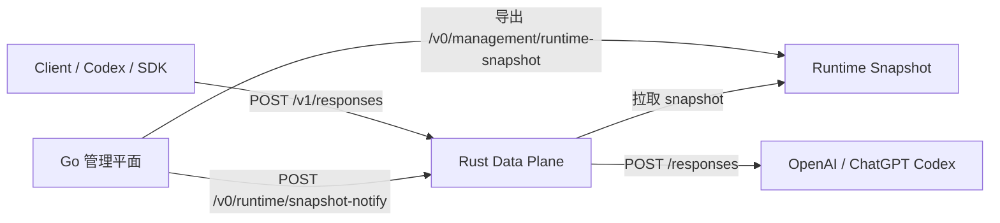
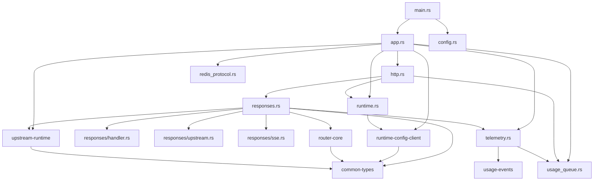
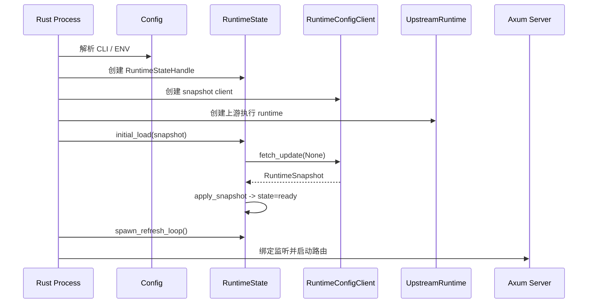
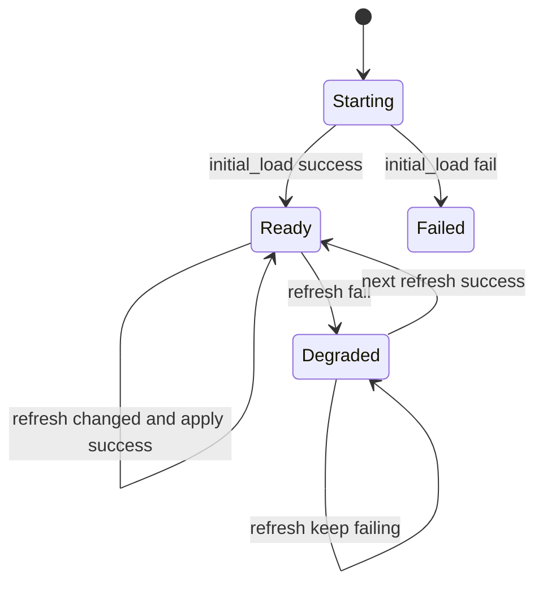
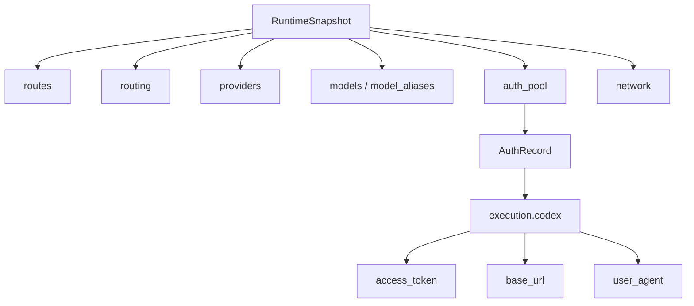
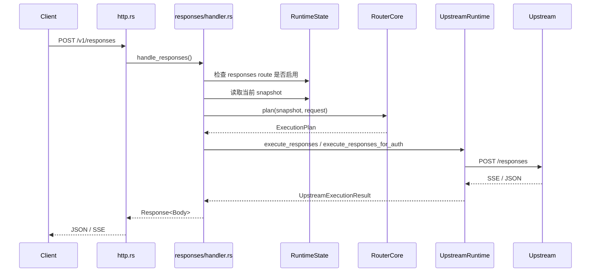
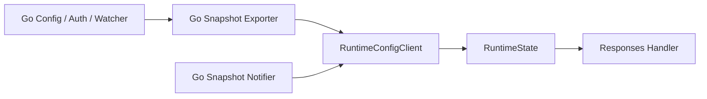

# CPA Rust 数据平面当前架构说明

## 1. 文档目标

本文档描述当前仓库里 `rust/cliproxy-data-plane/` 的**已落地实现架构**，重点回答以下问题：

- Rust 数据平面当前承担什么职责
- 它和 Go 管理平面如何协作
- 请求是怎样在 Rust 内部流转的
- 当前代码里的模块边界、状态流和失败语义是什么

本文档以当前代码为准，主要对应：

- `rust/cliproxy-data-plane/src/*.rs`
- `rust/cliproxy-data-plane/crates/router-core`
- `rust/cliproxy-data-plane/crates/runtime-config-client`
- `rust/cliproxy-data-plane/crates/upstream-runtime`
- `rust/cliproxy-data-plane/crates/usage-events`
- Go 侧 runtime snapshot 导出与通知链路

## 2. 当前定位

当前 Rust 数据平面还不是完整替代 Go 主代理，而是一个**专门承接 `/v1/responses` 的数据平面运行时**。

它当前的职责边界是：

- 从 Go 拉取 runtime snapshot
- 在本地维护一份原子可读的运行时快照
- 基于 snapshot 做 `/v1/responses` 的模型解析、账号选择、会话粘性和重试候选生成
- 直接请求上游 OpenAI / Codex Responses 接口
- 对外暴露健康检查、就绪状态、当前 snapshot 观测接口和 snapshot notify 接口
- 按 CPA `internal/redisqueue/plugin.go` 形状写入本地 usage queue，并暴露 HTTP pop 与 Redis RESP 兼容消费协议

它当前**不负责**：

- 配置编辑
- OAuth 登录
- auth 文件扫描和持久化
- 管理后台
- 完整的多协议入口（例如 `chat.completions`、`messages` 还没有接到真实执行链）

## 3. 高层结构

## 4. 进程内模块划分

## 5. 启动流程

当前启动入口在 `../src/main.rs` 和 `../src/app.rs`。

整体流程如下：

关键点：

- Rust 启动时必须先成功拿到第一份 snapshot，否则进程直接启动失败。
- 启动成功后会进入定时刷新循环，默认每 30 秒拉取一次 snapshot。
- 即便已经有定时轮询，Go 仍然可以通过 notify 接口触发 Rust 立即刷新。

## 6. 配置层

当前 Rust 进程配置在 `../src/config.rs` 中，主要分成三类：

### 6.1 服务监听

- `CLIPROXY_BIND`
- `CLIPROXY_LOG`

### 6.2 Snapshot 获取

- `CLIPROXY_SNAPSHOT_FILE`
- `CLIPROXY_SNAPSHOT_URL`
- `CLIPROXY_SNAPSHOT_BEARER_TOKEN`
- `CLIPROXY_SNAPSHOT_POLL_SECONDS`

这里明确要求二选一：

- 要么走本地文件
- 要么走 HTTP 拉取

不能同时配置两个 source。

### 6.3 上游执行

- `CLIPROXY_UPSTREAM_PROXY`
- `CLIPROXY_UPSTREAM_HTTP_PROXY`
- `CLIPROXY_UPSTREAM_HTTPS_PROXY`
- `CLIPROXY_OPENAI_BASE_URL`
- `CLIPROXY_OPENAI_API_KEY`
- `CLIPROXY_CODEX_BASE_URL`
- `CLIPROXY_CODEX_TOKEN`
- `CLIPROXY_CODEX_USER_AGENT`
- `CLIPROXY_CODEX_OPENAI_BETA`

这一层的含义是：

- snapshot 决定“该选哪个 auth、哪个 model、是否允许路由”
- 进程配置决定“如果需要真实出站，上游 HTTP client 怎么建、默认走哪个 base URL、默认带什么头”

## 7. Runtime State 层

当前运行时状态实现位于 `../src/runtime.rs`。

它内部维护两部分状态：

- `snapshot`
  - 使用 `ArcSwapOption<RuntimeSnapshot>`
  - 面向请求热路径
  - 支持无锁读取当前快照
- `metadata`
  - 使用 `RwLock`
  - 记录服务状态、snapshot 版本、最近刷新时间、最近错误

### 7.1 服务状态机

当前状态字段来自 `common-types::health::ServiceState`：

- `starting`
- `ready`
- `degraded`
- `failed`

语义上：

- `failed` 只出现在启动首轮 snapshot 拉取失败
- `degraded` 表示进程仍在服务，但最新 refresh 失败
- `ready` 表示当前持有可用 snapshot

## 8. Runtime Snapshot 契约

Rust 与 Go 的核心边界不是 RPC，而是 `RuntimeSnapshot` 数据结构，定义在 `../crates/common-types/src/lib.rs`。

当前 Rust 真正依赖的关键字段包括：

- `version`
- `generated_at`
- `source_instance_id`
- `listeners.public_http`
- `routes.responses`
- `routing.strategy`
- `routing.session_affinity`
- `routing.session_ttl_seconds`
- `providers`
- `model_aliases`
- `models`
- `auth_pool`
- `network.upstream_proxy`

### 8.1 结构分层

### 8.2 当前校验规则

`runtime-config-client` 在应用 snapshot 之前会做最小校验：

- `version` 不能为空
- `generated_at` 不能为空
- `source_instance_id` 不能为空
- `listeners.public_http` 不能为空
- 启用的 provider 必须能在 `models` 里找到对应条目
- model alias 不能为空映射
- `auth_pool` 中的 `id/provider` 不能为空
- Codex OAuth auth 必须带 `execution.codex.access_token`

这意味着当前 Rust 默认把 snapshot 视为**强契约输入**，而不是宽松 best-effort 输入。

## 9. HTTP 路由层

HTTP 路由定义在 `../src/http.rs`。

当前对外接口如下：

- `GET /healthz`
- `GET /readyz`
- `GET /v0/runtime/snapshot`
- `POST /v1/responses`
- `POST /v0/runtime/snapshot-notify`

### 9.1 路由职责

- `/healthz`
  - 返回当前服务状态和版本
- `/readyz`
  - 返回 `ready` 布尔值以及完整 runtime metadata
- `/v0/runtime/snapshot`
  - 返回当前进程内 snapshot 副本，便于调试和观测
- `/v1/responses`
  - 承接 OpenAI Responses 风格请求
- `/v0/runtime/snapshot-notify`
  - 接收 Go 的“有新 snapshot 版本”通知，并触发一次异步 refresh
- `/v0/management/usage-queue`
  - 按 CPA 管理面语义 pop 本地 usage queue，`count` 省略时弹出 1 条

### 9.3 当前可观测性最小闭环

当前已落地的里程碑 8 最小子集包括：

- `/v1/responses` 成功/失败路径上的 usage 提取
- `latency_ms`、`ttft_ms`、`response_headers` 等可直接写入 CPA usage payload 的字段沉淀
- 仅在 `usage_queue.enabled=true` 且 `usage_queue.backend=redis` 时异步发射
- 发射物字段形状对齐 CPA `internal/redisqueue/plugin.go`
- 本地 `UsageQueue` 支持 FIFO pop、subscriber fan-out、`support_refresh` 首包和 `refresh` 控制消息
- HTTP 暴露 `/v0/management/usage-queue?count=N`
- 同一 TCP listener 支持 Redis RESP 最小命令集：`AUTH`、`SUBSCRIBE usage/errors`、`LPOP/RPOP usage`
- RESP `AUTH` 在配置了 `snapshot_bearer_token` 时校验该 token；未配置时只保留 AUTH 命令语义

当前仍未落地的部分包括：

- Home 模式 `LPUSH usage` 转发
- errors 通道的真实错误 payload 生产来源
- dashboard / alert 的正式命名与 runbook

### 9.2 notify 语义

notify 接口本身**不承载配置正文**，只承载：

- `version`
- `generated_at`
- `reason`

Rust 收到后做的事情是：

1. 校验 payload
2. 异步调用 `runtime.refresh_once(snapshot_client)`
3. 重新从 snapshot source 拉取完整快照

这条链路保持了当前设计原则：

- `push` 只负责通知
- `pull` 负责取数
- snapshot 仍然是唯一事实来源

## 10. `/v1/responses` 请求路径

真实请求主链路位于 `../src/responses.rs` 和 `../src/responses/`。

### 10.1 请求前置检查

进入 `handle_responses()` 后，当前会先做三件事：

1. 检查 snapshot 是否启用了 `routes.responses`
2. 基于 snapshot 生成 execution plan
3. 确认当前 execution plan 可以落到真实 upstream 执行能力

如果这些前置条件失败，会直接返回：

- `404 route_disabled`
- `503 routing_unavailable`
- `502 upstream_unavailable`

### 10.2 RouterCore 的职责

`../crates/router-core/src/lib.rs` 当前负责：

- provider 判定
- model alias 解析
- auth 可用性过滤
- cooldown 过滤
- `fill-first` / `round-robin` 选择
- session affinity
- pinned auth
- retry candidates 生成

当前 `plan()` 的输出是 `ExecutionPlan`：

- `provider`
- `model`
- `auth_id`
- `retry_candidates`
- `stickiness_source`

### 10.3 当前 provider 范围

当前 `RouterCore` 在 `/v1/responses` 路径里实际固定选择 `ProviderKind::Codex`。

也就是说：

- Rust 数据平面虽然抽象里保留了 `OpenAi / Codex` 上游执行形态
- 但当前 `/v1/responses` 主链路主要按 Codex 场景设计和验证

### 10.4 当前模块拆分

当前 `responses` 目录按职责拆成四层主链路模块：

- `responses.rs`
  - 放共享请求/错误类型、header 处理和模块级单元测试
- `handler.rs`
  - 承担 `handle_responses()` 主编排
- `protocol.rs`
  - 承担 `/v1/responses` 的最小显式协议转换 IR
  - 包含 request IR 和 stream event IR
  - 负责把下游请求发射成当前 Codex / OpenAI 上游请求形状
  - 负责把 SSE frame 先解析成带类型的中间事件
- `upstream.rs`
  - 承担真实 upstream 执行、auth retry 和流聚合
- `sse.rs`
  - 承担 SSE frame 重组、流尾 flush 和 `response.completed.output` 修复
  - completed repair 前会先消费 `protocol.rs` 给出的 stream event IR

仓库里仍保留 `mock.rs` 历史文件，但它已经不在当前活跃编译图和生产控制流内。

## 11. 上游执行层

真实上游执行在 `../crates/upstream-runtime/src/lib.rs`。

当前职责包括：

- 构建默认 HTTP client
- 基于代理设置缓存不同 client
- 选择 OpenAI 或 Codex upstream
- 构建请求头
- 发送非流式或流式请求
- 将上游响应包装成统一 `UpstreamExecutionResult`

### 11.1 出站代理模型

当前代理设置支持：

- `inherit`
- `direct`
- `proxy(http|https|socks5|socks5h)`

当前优先级大致是：

1. 请求级 `proxy_override`
2. 进程配置 `http_proxy / https_proxy / upstream_proxy`
3. 默认直连或继承

### 11.2 Codex auth 执行

如果 execution plan 选中了某个 Codex OAuth auth，Rust 会优先使用 snapshot 中该 auth 自带的：

- `access_token`
- `account_id`
- `base_url`
- `user_agent`
- `openai_beta`

这意味着当前 Rust 不是只依赖进程级固定 token，而是能直接消费 Go 下发的 auth 执行信息。

## 12. 重试与额度耗尽切换

当前 `/v1/responses` 路径已经具备**账号级重试链**。

逻辑在 `responses/upstream.rs::execute_upstream_with_retries()`：

- 先尝试 execution plan 选中的主 auth
- 如果错误满足“可重试的 auth 绑定错误”，则继续尝试 `retry_candidates`

当前会触发切换的典型错误包括：

- Codex `401`
- Codex `403`
- Codex `429 + usage_limit_reached`
- `account_deactivated`
- `invalid_api_key`

这意味着当前 Rust 侧已经具备了最小 MVP 的“账号额度耗尽 / 账号失效后切到下一个 auth”的能力。

## 13. 流式与非流式响应处理

当前支持两种模式：

- 非流式：直接返回 JSON body
- 流式：直接透传 SSE body

另外还有一个特殊分支：

- 如果 provider 是 Codex，且下游请求是 `stream=false`
- 但上游更适合以流模式返回
- Rust 会把上游 SSE 聚合为最终 `response.completed.response` JSON 再回给下游

这个逻辑在：

- `aggregate_streaming_response_body()`
- `extract_completed_response_from_sse()`

### 13.1 SSE 分帧与完成事件修复

当前 Rust `/v1/responses` 流式主链路已经补上一层最小 SSE framer，用于在上游 Responses 流返回时做基础兼容修复。

当前已覆盖：

- 将被拆开的 `event:` / `data:` chunk 重新拼成完整 SSE frame
- 对已经构成合法 frame、但缺少分隔符的尾部数据做标准化输出
- 记录 `response.output_item.done` 事件中的 output item
- 当 `response.completed.response.output` 为空时，用已记录的 output item 补齐最终 completed payload

这层逻辑同时用于：

- 流式下游透传
- Codex `stream=false` 但上游以流形式返回时的聚合路径

因此当前 Rust 不再只是简单字节透传，而是具备了最小闭环的：

- SSE 重组
- completed output repair
- 流尾 flush

## 14. 当前和 Go 的协作方式

### 14.1 配置与状态边界

当前职责划分是：

- Go 负责产生“规范化后的运行时事实”
- Rust 负责消费这份运行时事实并执行热路径请求

### 14.2 单机 embedded 形态

在最新代码里，Go 还支持 embedded 模式启动 Rust data plane。

在这个形态下：

- Go 负责拉起 Rust 子进程
- Go 通过本地 management token 暴露 snapshot HTTP 源
- Rust 用 `snapshot_url + bearer_token` 回拉
- Go 配置变化后通过 notify 驱动 Rust 立即 refresh

但即便是 embedded 形态，Rust 内部架构本身并没有变化，仍然是：

- snapshot client
- runtime state
- router core
- upstream runtime
- axum http server

## 15. 当前限制

按当前代码看，Rust 数据平面仍有这些明确限制：

- 真实热路径目前只覆盖 `/v1/responses`
- 路由器在 responses 主链路里仍然偏 Codex-only
- Rust 还没有独立的 auth 持久层，完全依赖 Go snapshot
- 流量实例注册/心跳/实例池调度还不在当前 Rust 进程内
- 观测能力目前以健康状态、snapshot 版本和 tracing 日志为主

## 16. 总结

当前 Rust 数据平面的架构可以概括为：

- **输入面**：配置来自 CLI / ENV，运行时事实来自 Go 导出的 snapshot
- **状态面**：`RuntimeStateHandle` 持有原子 snapshot 和可观测 metadata
- **决策面**：`RouterCore` 基于 snapshot 做模型解析、账号选择、粘性和重试候选生成
- **执行面**：`UpstreamRuntime` 负责真实上游 HTTP / SSE 请求
- **服务面**：`Axum` 暴露健康检查、snapshot 观测、notify 和 `/v1/responses`

如果用一句话概括当前形态：

> Rust 现在已经是一个“以 runtime snapshot 为配置事实来源、以 `/v1/responses` 为核心职责、可被 Go 通知热更新”的独立数据平面运行时。
