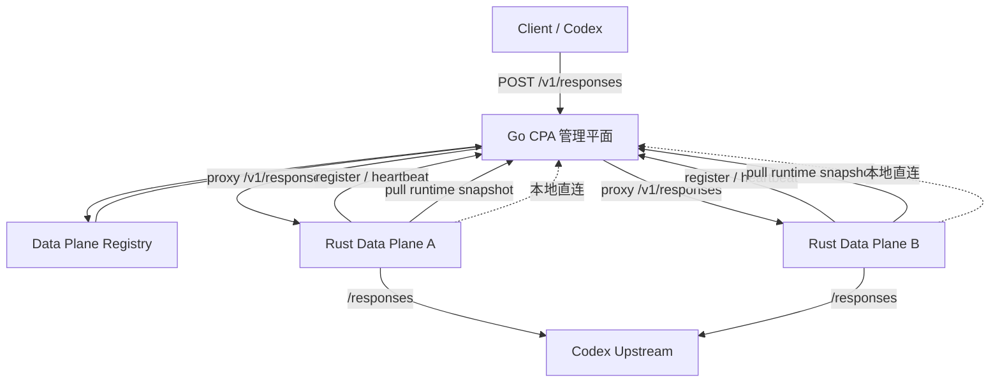
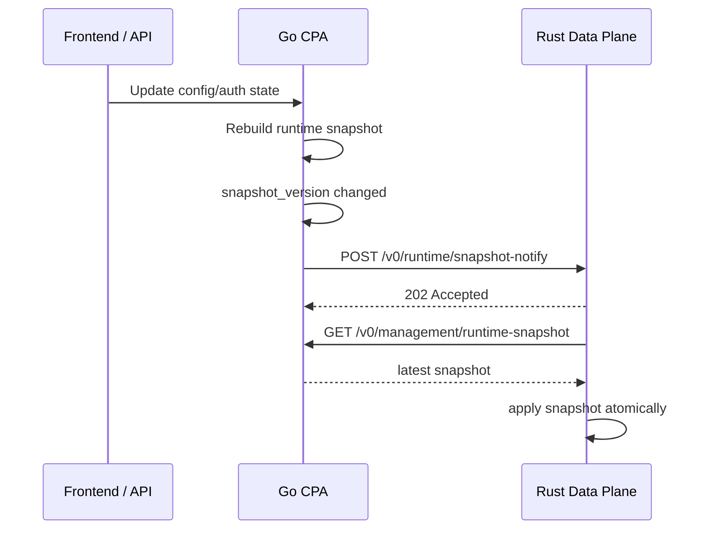

# Go 管理 Rust 数据平面产品化设计

> 本文档是 Go 管理 Rust 数据面实例、生命周期和产品化部署的设计参考。当前已实现事实以 `../current/` 和仓库级 `.ai-harness/shared/` 为准。

## 1. 文档目标

本文档用于把当前“Go 管理平面 + Rust 数据平面”的联调形态，推进到可以长期演进、具备实例管理能力的产品化形态。

当前仓库已经具备：

- Go 导出 runtime snapshot
- Rust 拉取并应用 runtime snapshot
- Rust 独立承接 `/v1/responses`
- Go 可选把 `/v1/responses` 转发给 Rust

但当前仍存在明显的“联调态”特征：

- Go 到 Rust 的接入仍依赖静态 `responses-base-url`
- Rust 实例没有注册、心跳、摘流量机制
- Go 无法稳定感知 Rust 实例生命周期
- 多实例场景没有实例池与调度能力

本文档的目标是把这套链路收敛成：

`Go 作为管理平面与实例控制面，Rust 作为可注册、可探活、可摘流量的数据平面实例。`

## 2. 当前状态

### 2.1 当前能力

当前已经完成的能力：

- Go 管理平面可以导出 runtime snapshot
- Rust 数据平面可以通过文件或 HTTP 拉取 snapshot
- Rust 已支持 `ready / degraded / failed` 运行时状态
- Rust 已实现 `/v1/responses -> router-core -> upstream-runtime`
- Go 已支持可选 sidecar 转发 `/v1/responses`

### 2.2 当前问题

当前主要问题：

- Go 只知道一个静态的 Rust URL，不知道实例集合
- Rust 没有向 Go 报到，Go 不知道哪些实例在线
- Rust 失败时，Go 不能自动摘流量
- 未来扩到多 Rust 实例时，无法做基础调度
- 观测面缺少“请求命中了哪个 Rust 实例”的管理语义
- Go 与 Rust 的上游代理策略仍是分裂配置，缺少统一下发
- Rust 当前只靠定时轮询 snapshot，配置变更不能低延迟生效

## 3. 产品化目标

### 3.1 目标形态

产品化后应达到以下目标：

1. Go 持有 Rust data plane 实例表
2. Rust 启动后主动注册到 Go
3. Rust 周期性向 Go 发送心跳
4. Go 能基于实例状态做 `/v1/responses` 流量转发
5. Go 能在实例不健康时自动摘流量
6. Rust 继续通过 snapshot 消费 Go 的运行时配置
7. Go 能通过 snapshot 向 Rust 下发默认上游代理策略
8. Go 能在 snapshot 语义变化时通知 Rust 立即刷新配置

### 3.2 首期范围

首期产品化只做最小闭环：

- 只覆盖 `/v1/responses`
- 只覆盖 Codex 使用场景
- 只覆盖单管理平面、多 Rust 实例
- 只做基础注册、心跳、实例选择、摘流量

首期明确不做：

- 使用事件正式回传
- 指标平台接入
- WebSocket 型 provider 数据面
- 多管理平面选主
- 自动实例拉起与进程编排
- Go 与 Rust 之间的本地控制面通信代理编排
- Go 直接向 Rust 推送整份运行时配置正文

## 4. 设计原则

- Go 仍然是配置、auth 状态和管理写操作的事实来源
- Rust 只负责数据热路径和局部运行时状态
- 优先增加新层，不打碎旧 Go 处理链路
- 所有接管点都必须具备快速回退路径
- 产品化第一版优先正确性与可观测性，不先追求复杂调度
- 本地控制面链路与外部上游链路必须分开建模
- snapshot 仍然是 Rust 运行时配置的唯一事实来源
- 推送通道只负责“变更通知”，不承载完整配置正文

## 5. 目标架构



## 6. 关键设计

### 6.1 Go 侧新增 Data Plane Registry

Go 侧新增一个内存级实例注册表，用于维护当前活跃的 Rust data plane 实例。

实例注册表至少记录：

- `instance_id`
- `public_http`
- `version`
- `capabilities`
- `registered_at`
- `last_seen_at`
- `health_state`
- `snapshot_version`
- `status`

其中：

- `health_state` 反映 Rust 自报状态，如 `ready / degraded / failed`
- `status` 反映 Go 的调度视角，如 `active / draining / offline`

### 6.2 Rust 启动注册

Rust 启动成功后，在首次进入 `ready` 之前或之后，向 Go 发起注册请求。

建议上报字段：

- `instance_id`
- `public_http`
- `version`
- `service`
- `routes`
- `providers`
- `capabilities`

首期建议 `instance_id` 由 Rust 本地生成，规则保持稳定即可，例如：

- 主机名 + 绑定地址
- 或主机名 + 进程启动时间戳

### 6.3 Rust 心跳

Rust 定时向 Go 发送心跳，建议间隔 10s 到 30s。

心跳至少上报：

- `instance_id`
- `health_state`
- `snapshot_version`
- `last_error`
- `bind_addr`

Go 以 `last_seen_at` 判断实例是否超时失联。

### 6.4 Rust 继续通过 snapshot 消费配置

Rust 的运行时配置消费链路继续保留：

- `GET /v0/management/runtime-snapshot`

首期仍采用 Rust 主动拉取模式，不改成 Go 推送。

原因：

- 当前代码已基本具备
- 失败模式明确
- 对 Rust 生命周期耦合较低
- 更适合首版产品化快速收敛

### 6.5 在轮询基础上补充实时推送

仅靠 Rust 定时轮询 snapshot，虽然实现简单，但存在两个明显问题：

- 配置生效延迟受轮询间隔影响
- 大规模实例场景下，纯轮询会带来不必要的控制面噪音

因此建议在保留轮询兜底的前提下，增加一条轻量实时推送链路。

这条链路的职责不是“推送配置正文”，而是：

- Go 判定 snapshot 语义发生变化
- Go 向相关 Rust 实例发送“有新 snapshot 版本”的通知
- Rust 收到通知后立即重新拉取 snapshot
- Rust 原子应用新 snapshot

也就是：

- `push` 负责通知
- `pull` 负责取数
- `snapshot` 负责承载完整配置事实

这样做的好处是：

- 不需要维护第二套配置协议
- Rust 断线恢复后只要重新拉取 snapshot 即可追平状态
- Go 与 Rust 仍然围绕一个 `snapshot_version` 对齐
- 推送失败时仍可退回定时轮询，不影响正确性

### 6.6 哪些情况触发实时推送

实时推送的判定标准不应是“配置文件发生修改”，而应是：

`当前有效 runtime snapshot 的语义是否发生变化。`

也就是只要重新构建出的 snapshot 内容变化，并导致 `snapshot_version` 变化，就应触发推送。

建议触发源至少包括：

1. 全局上游代理变化
   - `proxy-url`
   - 会影响 `Rust -> Provider`

2. 路由能力变化
   - `routes.responses`
   - 未来若有 `chat_completions`、`messages` 等路由位也同理

3. 路由策略变化
   - `routing.strategy`
   - `routing.session_affinity`
   - `routing.session_ttl_seconds`

4. provider 状态变化
   - 某 provider 的 `enabled` 状态变化

5. model 能力变化
   - `model_aliases`
   - `models`

6. auth pool 变化
   - auth 新增、删除、禁用、恢复
   - auth 支持模型变化
   - auth labels / priority / cooldown 变化
   - token 刷新后 execution 数据变化

7. listeners / feature flags / usage queue / network 等 snapshot 字段变化
   - 前提是这些字段已经被 Rust 运行时消费，或预期会被消费

不建议把“原始配置文件有改动但 snapshot 结果未变”也视作推送事件。

例如：

- 注释变化
- 无关字段顺序变化
- 只影响 Go 本身、不影响 Rust 运行时决策的配置变化

这类变化不应触发 push。

### 6.7 哪些变化不应走 snapshot 实时推送

以下信息不适合放进 snapshot push 机制：

- 单次请求级临时参数
- 人工临时摘流量命令
- `drain`、`resume`、`shutdown` 这类实例控制指令
- 诊断类或展示类临时状态

原因是这些内容更像“控制命令”而不是“运行时配置事实”。

建议拆分为两类：

1. 配置事实
   - 走 `runtime snapshot`
   - 由 Go 生成版本
   - 由 Rust 拉取并原子应用

2. 控制命令
   - 走独立 control-plane API 或事件通道
   - 明确 request / ack / retry / timeout 语义

### 6.8 实时推送建议模型

建议 Go 与 Rust 之间新增一条极简通知接口，例如：

```text
POST /v0/runtime/snapshot-notify
```

请求体建议只包含：

```json
{
  "version": "sha256:...",
  "generated_at": "2026-06-22T09:00:00Z",
  "reason": "runtime_snapshot_changed"
}
```

Rust 收到后不直接使用请求体中的配置内容，而是立即执行：

```text
GET /v0/management/runtime-snapshot
```

然后按现有流程：

1. 比较当前 `snapshot_version`
2. 若版本变化则应用新 snapshot
3. 若版本未变化则忽略

建议 Rust 对通知请求返回：

- `202 Accepted`
  - 表示“已接收刷新通知，将异步拉取”

而不是等待拉取与应用完成后再同步返回。

这样可以避免：

- Go 被单个 Rust 实例的拉取耗时阻塞
- 通知接口承担过多同步语义

### 6.9 轮询与推送并存策略

实时推送不能替代轮询，二者应并存：

1. 推送负责低延迟
   - 配置改动后尽快通知 Rust 刷新

2. 轮询负责兜底
   - Rust 漏掉通知
   - Go 推送失败
   - Rust 实例重启后未收到旧事件
   - 临时网络抖动

推荐语义：

- Rust 继续保留当前 snapshot poll loop
- Go 在 snapshot 版本变化时，额外触发一次 notify fan-out
- Rust 任何时候都以最新拉到的 snapshot 为准

推荐时序：



### 6.10 Go 侧推送触发点建议

Go 内部不应在“任何管理 API 被调用”时都盲目推送。

更合理的触发方式是：

1. 变更先落到当前有效配置 / auth 状态
2. Go 重新构建 snapshot
3. 比较新旧 `snapshot_version`
4. 只有版本变化时，才向活跃 Rust 实例推送 notify

因此推送触发点通常会落在以下事件之后：

- 管理面配置保存成功
- auth 文件或 auth 内存状态变化
- token refresh 导致 auth execution 变化
- watcher/synthesizer 完成一次有效重建

这一设计可以避免：

- 重复推送
- 无效推送
- 把“文件变化”错误等同于“运行时配置变化”

### 6.11 Go 通过 snapshot 下发默认上游代理

Go 当前已有 `proxy-url`，它本质上是 Go 进程自己的默认出站代理。

产品化后，Rust 不应再只靠独立环境变量手工配置代理，而应能消费 Go 下发的默认上游代理策略。

首期建议：

- 在 `runtime snapshot` 中新增 `network.upstream_proxy`
- 由 Go 从当前有效配置中的 `proxy-url` 导出
- Rust 在应用 snapshot 时同步更新默认 upstream proxy 语义

这项设计只作用于：

- `Rust -> Provider`

不作用于：

- `Rust -> Go`
- `Go -> Rust`

即：

- Rust 拉取 snapshot
- Go 向 Rust 转发 `/v1/responses`
- Go 探测 Rust 健康状态

都必须保持本地直连，不走代理。

### 6.12 统一代理语义

Go 与 Rust 应统一使用同一套代理语义，避免一个支持 `socks5`、另一个只支持 `http` 的行为分叉。

建议支持以下取值：

1. 空值
   - `inherit`
   - 表示未显式指定代理，允许进程退回到自身运行时默认配置

2. `direct`
   - 强制直连
   - 明确禁止请求走任何代理

3. 显式代理 URL
   - `http://...`
   - `https://...`
   - `socks5://...`
   - `socks5h://...`

其中：

- `inherit` 不是“Rust 自动继承 Go 的 client 实例”
- 而是“Rust 允许使用它自己的配置优先级回退链”

Rust 的建议优先级：

1. Rust CLI 参数
2. Rust 环境变量
3. snapshot `network.upstream_proxy`
4. 空值 / 默认行为

### 6.13 Rust 补齐 socks5 / socks5h

当前 Go 已支持 `http(s)`、`socks5`、`socks5h` 和 `direct` 语义。

Rust 首期产品化应补齐：

- `http`
- `https`
- `socks5`
- `socks5h`
- `direct`
- `inherit`

这样可以保证：

- 本地开发通过 Clash / Surge / socks5 代理时，Go 与 Rust 行为一致
- 管理面只需要维护一套代理策略语义
- 真实上游联调不再依赖手工为 Go / Rust 分别传不同环境变量

### 6.14 Go 侧 `/v1/responses` 动态转发

Go 不再只依赖单个 `data-plane.responses-base-url`，而是：

- 从实例注册表中选择一个可用 Rust 实例
- 将 `/v1/responses` 转发到该实例

首期建议实例选择策略：

1. 只选 `status=active`
2. 只选 `health_state=ready`
3. 按注册表顺序做最简单 round-robin

未来再扩展：

- 权重
- zone 感知
- draining
- 错误熔断

### 6.15 摘流量与回退

Go 必须具备最小摘流量能力。

首期建议规则：

- 心跳超时：自动标记 `offline`
- Rust 上报 `failed`：自动从调度池剔除
- Rust 上报 `degraded`：可配置是否继续接流量

当没有任何 Rust 实例可用时，Go 保留回退能力：

- 回到旧 Go 原生 `/v1/responses` 实现
- 或直接返回明确错误

首期推荐：

- 默认保留旧 Go 链路作为回退路径

## 7. 接口设计

### 7.1 Rust 注册接口

建议新增：

```text
POST /v0/management/data-planes/register
```

建议请求体：

```json
{
  "instance_id": "dp-macmini-127.0.0.1-4100",
  "public_http": "http://127.0.0.1:4100",
  "service": "cliproxy-data-plane",
  "version": "0.1.0",
  "routes": {
    "responses": true
  },
  "providers": {
    "codex": true
  },
  "capabilities": [
    "responses",
    "codex_oauth"
  ]
}
```

### 7.2 Rust 心跳接口

建议新增：

```text
POST /v0/management/data-planes/heartbeat
```

建议请求体：

```json
{
  "instance_id": "dp-macmini-127.0.0.1-4100",
  "health_state": "ready",
  "snapshot_version": "sha256:...",
  "last_error": null
}
```

### 7.3 实例查询接口

建议新增：

```text
GET /v0/management/data-planes
```

用于管理面查看当前 Rust 实例。

### 7.4 实例控制接口

建议后续新增：

```text
POST /v0/management/data-planes/:id/drain
POST /v0/management/data-planes/:id/activate
DELETE /v0/management/data-planes/:id
```

首期可以先不做，但数据结构需要预留。

## 8. 数据结构建议

### 8.1 Go 侧实例结构

建议：

```text
DataPlaneInstance
  instance_id
  public_http
  service
  version
  routes
  providers
  capabilities
  health_state
  snapshot_version
  last_error
  registered_at
  last_seen_at
  status
```

### 8.2 状态枚举建议

Rust 自报健康状态：

- `starting`
- `ready`
- `degraded`
- `failed`

Go 调度状态：

- `active`
- `draining`
- `offline`

## 9. 配置演进建议

### 9.1 当前配置

当前 Go 配置是：

```yaml
data-plane:
  responses-base-url: "http://127.0.0.1:4100"
```

这更像“静态 sidecar 地址”配置。

### 9.2 建议演进方向

建议后续演进为：

```yaml
data-plane:
  mode: "registry"
  fallback-to-go: true
  heartbeat-timeout-seconds: 30
  selection-strategy: "round-robin"
```

Rust 侧建议新增：

```text
CLIPROXY_CONTROL_PLANE_URL
CLIPROXY_CONTROL_PLANE_BEARER_TOKEN
CLIPROXY_PUBLIC_HTTP
CLIPROXY_INSTANCE_ID
CLIPROXY_HEARTBEAT_SECONDS
```

首期也可以先只靠 CLI 参数，不急着一次加全。

## 10. 失败模式

### 10.1 Go 可用，Rust 不可用

处理策略：

- Go 从实例池摘掉对应 Rust
- 若允许回退，则回到旧 Go `/v1/responses`
- 若不允许回退，则返回明确的 data plane unavailable 错误

### 10.2 Rust 可用，snapshot 拉取失败

处理策略：

- Rust 保持最近一次有效 snapshot
- 状态进入 `degraded`
- 继续心跳上报 `degraded`

### 10.3 Go 不可用，Rust 已有有效 snapshot

处理策略：

- Rust 继续跑热路径
- 注册与心跳失败只影响管理可见性
- snapshot 刷新失败后进入 `degraded`

### 10.4 多实例部分失联

处理策略：

- Go 只从 `ready + active` 实例里选流量
- 失联实例自动 `offline`

## 11. 实施计划

### 阶段 1：单实例受管

目标：

- 不改变 snapshot 主链
- 引入 Rust 注册与心跳
- Go 通过实例表而不是静态 URL 转发 `/v1/responses`

任务：

- Go 新增 data plane registry
- Go 新增 register / heartbeat / list 接口
- Rust 新增注册与心跳客户端
- Go `/v1/responses` 动态选择单个 ready Rust 实例

验收标准：

- Rust 启动后能在 Go 管理面注册
- Go 能看见 Rust 在线状态
- Go 能把 `/v1/responses` 转发到已注册 Rust

### 阶段 2：多实例最小调度

目标：

- 支持多个 Rust data plane 实例同时注册

任务：

- Go registry 支持实例池
- 增加简单 round-robin
- 心跳超时自动摘流量

验收标准：

- 两个 Rust 实例可同时在线
- Go 能在两者间分配 `/v1/responses`
- 摘掉一个实例后流量不受影响

### 阶段 3：运维能力补齐

目标：

- 让这套链路具备基础运维可用性

任务：

- 增加实例列表管理接口
- 增加 draining / activate 能力
- 增加基础审计字段
- 增加 request id 贯穿

验收标准：

- 管理面可以看到所有 Rust 实例
- 可手动摘流量与恢复
- 请求可以追踪到命中的 Rust 实例

## 12. 与当前代码的衔接建议

当前最适合复用的代码基础：

- Go runtime snapshot 导出器
- Go `/v1/responses` sidecar proxy 逻辑
- Rust `/healthz`、`/readyz`
- Rust runtime state
- Rust snapshot client
- Rust `/v1/responses` 主执行链

当前最适合新增的新层：

- Go `data plane registry`
- Go `data plane management handlers`
- Rust `control-plane-client`

原则上：

- 不直接推翻现有 `data-plane.responses-base-url`
- 而是先把它降级为兼容模式或 fallback 模式

## 13. 首期建议结论

产品化第一步不应该继续围绕静态 sidecar 地址做更多胶水，而应该尽快引入：

1. Rust 注册
2. Rust 心跳
3. Go 实例表
4. Go 基于实例表做 `/v1/responses` 动态转发

这样做之后，当前这套 Rust 数据平面才真正从“联调 sidecar”变成“受 Go 管理的产品化数据平面实例”。
