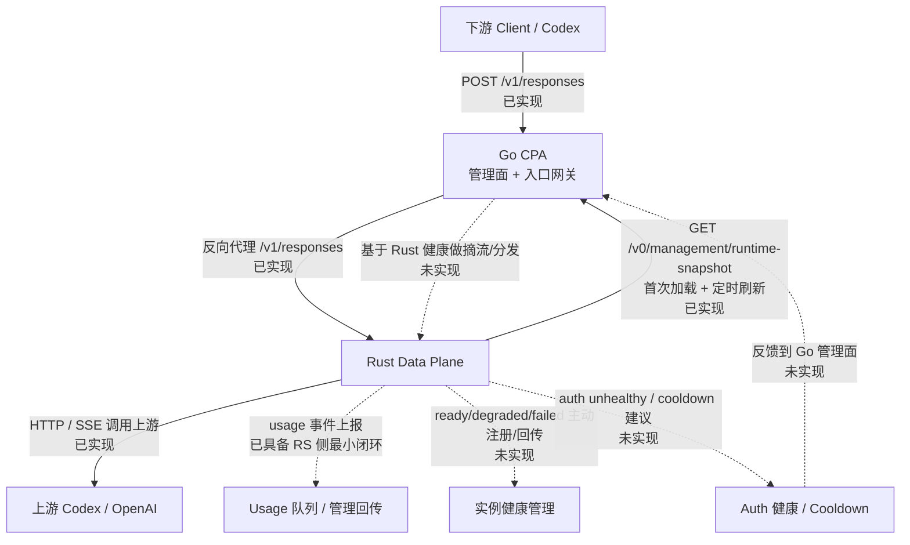
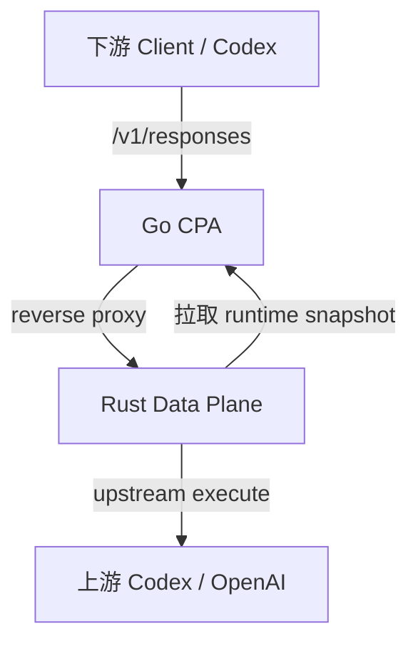
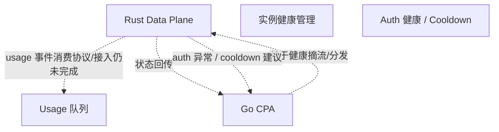

# CPA 与 Data Plane 通信矩阵

## 1. 文档目标

本文档用于明确当前设计下 Go 管理平面（CPA）与 Rust 数据平面（Data Plane）之间的通信关系，帮助后续实现时区分：

- 哪些通信属于控制面
- 哪些通信属于热路径
- 哪些通信已经实现
- 哪些通信仍停留在设计阶段

说明：

- 本文档属于 `history/` 阶段记录，主要保留迁移过程中的阶段性判断。
- 当前实现事实应以 `rust/cliproxy-data-plane/docs/current/` 和 `.ai-harness/shared/` 下的现状文档为准。

## 2. 总体原则

当前设计下，CPA 与数据平面的通信遵循以下原则：

- Go 负责配置、auth 状态、管理写操作和后台维护任务
- Rust 负责请求接入、流式转发、上游执行、协议转换和热路径状态
- 请求主链路尽量不再经过 Go
- Go 与 Rust 的交互应尽量放在控制面通信和运行反馈层，而不是把 Go 放回数据热路径中

一句话概括：

`Go 负责告诉 Rust 该怎么跑，Rust 按快照独立跑流量，再把运行结果和健康信号回传。`

交互点标记说明：

- `【当前交互点】` 表示 Rust 侧已经有明确代码入口，接下来只差 Go CPA 接上即可
- `【已联通】` 表示两端都已经接通
- `【仅设计】` 表示当前还停留在设计层

文档更新时间：

- 2026-06-17：已同步到“Go snapshot 导出已实现、Rust `/v1/responses` 可真实执行、Go 可选 sidecar 转发已实现”的状态
- 2026-06-30：已同步到“Rust `/v1/responses` usage queue 最小闭环已落地、Prometheus-style metrics endpoint 未采用、无真实 upstream 时直接报错不再 mock fallback”的状态

## 3. 通信矩阵

| 方向 | 发起方 | 接收方 | 内容 | 建议协议 | 是否热路径 | 当前状态 |
|---|---|---|---|---|---|---|
| 配置下发 | Rust 拉取 | Go CPA | `runtime snapshot` 全量快照 | 本地 loopback HTTP | 否 | `【已联通】` Go 已提供 `/v0/management/runtime-snapshot`，Rust 已支持文件 / HTTP 拉取与原子应用 |
| 快照刷新 | Rust 定时拉取 | Go CPA | 最新 `version` 对应的运行时配置 | 本地 loopback HTTP | 否 | `【已联通】` Rust 已支持轮询、版本比较、`degraded` 降级；Go 已能稳定导出 snapshot |
| 首次启动校验 | Rust | Go CPA | 首次 snapshot 获取 | 本地 loopback HTTP | 否 | `【已联通】` Rust 已支持 fail closed，Go 已提供正式 snapshot 接口 |
| 代理策略下发 | Rust 拉取 | Go CPA | 默认上游代理语义，如 `inherit` / `direct` / `socks5://...` | 本地 loopback HTTP | 否 | `【已设计】` 计划并入 `runtime snapshot`，仅作用于 `Rust -> Provider`，不作用于 `Go <-> Rust` |
| 流量接入 | Client | Rust Data Plane | 当前聚焦 `/v1/responses`，后续再扩 `/v1/chat/completions` 等请求 | HTTP / SSE | 是 | Rust 已实现 `/v1/responses` ingress，并已接入 router-core 选路 |
| 上游执行 | Rust Data Plane | Provider | OpenAI / Codex / Claude / Gemini 请求 | HTTP / WebSocket / SSE | 是 | Rust 已实现 OpenAI / Codex 的 `/responses` HTTP upstream v1，并已打通 Codex OAuth 真实执行；Claude / Gemini / WebSocket relay 仍未实现 |
| usage 输出 | Rust Data Plane | Go CPA 或队列系统 | usage 事件 | queue / 本地日志型 producer | 否 | `【已部分联通】` Rust 已能按 CPA-shaped payload 产生 `/v1/responses` usage 事件并投递到异步 producer；Go 侧正式消费协议仍未接入 |
| 健康信号回传 | Rust Data Plane | Go CPA | `ready / degraded / failed`、错误摘要 | 管理接口 / 指标抓取 | 否 | `【当前交互点】` Rust 本地已有状态与 `/healthz`、`/readyz`，Go 未接入 |
| auth 健康回传 | Rust Data Plane | Go CPA | auth unhealthy、cooldown 建议 | 管理接口 / 事件流 | 否 | `【仅设计】` 尚未实现 |
| 指标采集 | 监控系统或 Go | Rust Data Plane | 请求数、首字节延迟、流时长等指标 | `待确认` | 否 | `【仅设计】` 当前未暴露独立 HTTP metrics endpoint；运维最小闭环优先落在 health/readiness 与 usage queue |
| 管理写操作 | Operator / Go 管理面 | Go CPA | 配置修改、auth 管理、OAuth 生命周期控制 | Go 内部管理 API | 否 | 已在 Go 侧存在 |
| 热路径绕过 | Rust Data Plane | Client / Provider | 请求与响应主链路 | 直接连接 | 是 | 已形成 `/v1/responses -> Rust -> OpenAI/Codex upstream` 的基础闭环 |
| 入口切流 | Go CPA | Rust Data Plane | 把 `/v1/responses` 请求转发给 sidecar | 本地 HTTP reverse proxy | 是 | `【已联通】` Go 已支持通过 `data-plane.responses-base-url` 可选转发 `/v1/responses` 与 `/backend-api/codex/responses` |

## 4. 当前交互状态图

### 4.1 已实现与未实现总览

### 4.2 已实现交互

### 4.3 未实现交互

## 5. 当前已标出的 CPA 交互点

当前真正和 CPA 相关、并且已经在 Rust 侧有明确接入位置的点，只有下面 4 个：

1. 配置下发
   - Rust 已具备消费 `runtime snapshot` 的能力
   - 代码入口：
     - `crates/runtime-config-client`
     - `src/runtime.rs`

2. 快照刷新
   - Rust 已具备定时轮询、版本比较、原子切换、失败降级能力
   - 代码入口：
     - `crates/runtime-config-client`
     - `src/runtime.rs`

3. 首次启动校验
   - Rust 已具备首次加载 snapshot 失败时 fail closed 的行为
   - 代码入口：
     - `src/app.rs`
     - `src/runtime.rs`

4. 健康信号回传
   - Rust 已具备本地暴露健康状态的能力，但 Go 还没有消费
   - 当前可见接口：
     - `/healthz`
     - `/readyz`

5. Go 入口切流
   - Go 已可选把 `/v1/responses` 转发到 Rust sidecar
   - 当前代码入口：
     - `internal/api/dataplane_proxy.go`
     - `internal/api/server.go`
   - 当前配置项：
     - `data-plane.responses-base-url`

还没有进入“当前交互点”或“已联通”的内容：

- auth unhealthy / cooldown 回传
- metrics 采集

已经从“仅设计”推进到 Rust 侧最小闭环、但尚未形成 Go 侧完整消费协议的内容：

- usage 回传

这些还没有形成可供 CPA 直接对接的稳定接口。

## 6. 当前最关键的两条通信链

### 6.1 Go 到 Rust

当前最重要的控制面通信是：

- Go 提供 `runtime snapshot`
- Rust 周期性拉取并原子应用

这条链的特点是：

- 不在业务热路径上
- Go 是事实来源
- Rust 是快照消费者
- 配置更新通过版本号驱动，而不是推送式强耦合控制

### 6.2 Rust 到 Go

当前最重要的反馈面通信是：

- usage 事件
- 健康状态
- auth 健康信号
- cooldown 建议
- 严重错误信号

这条链当前仍未完全定死协议，但已经有一个最小落地点：

- Rust 已能为 `/v1/responses` 产出 CPA-shaped usage payload
- Go 侧消费、订阅或队列协作协议仍待继续对齐
- 这些回传都不应把 Go 重新拉回请求主链路

## 7. 热路径与非热路径边界

### 7.1 热路径

真正属于热路径的通信是：

- `Client -> Rust Data Plane`
- `Rust Data Plane -> Provider`
- `Provider -> Rust Data Plane`
- `Rust Data Plane -> Client`

这些通信必须由 Rust 独立承担，Go 不应重新插入中间转发。

### 7.2 非热路径

不属于热路径但必须存在的通信是：

- Rust 拉取 Go snapshot
- Rust 回传 usage 和健康信号
- Go 管理面写入配置和 auth 状态

这些通信更关注正确性、可恢复性和可观测性，而不是单请求延迟。

额外约束：

- `Go <-> Rust` 的本地控制面通信应始终直连
- 本地 snapshot 拉取、健康探测、sidecar 转发不应走全局出口代理
- 代理策略只应用于 `Go -> Provider` 或 `Rust -> Provider` 的外部上游请求

## 8. 当前实现状态

### 8.1 Rust 已实现

- 本地文件 snapshot 拉取
- HTTP snapshot 拉取能力
- snapshot 基础校验
- snapshot 版本比较
- snapshot 原子切换
- 运行时状态切换：`ready / degraded / failed`
- `/healthz`
- `/readyz`
- `/v1/responses` ingress
- OpenAI `/responses` upstream HTTP 执行
- Codex `/responses` upstream HTTP 执行
- `/v1/responses` 最小显式协议转换 IR
- `/v1/responses` SSE 分帧修复与 parity fixture 覆盖
- `router-core` 第一版
- `ExecutionPlan`
- model alias 解析
- `fill-first`
- 最高 priority 层内 `round-robin`
- session affinity TTL
- pinned auth 语义保留
- retry candidates 产出
- 按 `ExecutionPlan.auth_id` 驱动 Codex OAuth `/responses` 上游执行
- `/v1/responses` 热路径接入 router-core 选路
- Codex 上游最小 payload 适配：
  - `store: false`
  - 缺省 `instructions`
  - 字符串 `input` 转 message 结构
  - 去掉 `metadata`
- 对 Codex 上游的 `stream=false -> stream=true -> 聚合回非流式 JSON`
- 可重试 Codex auth 失败后的自动切换执行
- `/v1/responses` usage queue 最小闭环
- 无真实 upstream 执行能力时直接返回 `502 upstream_unavailable`
- `/v1/responses` 不再走本地 mock fallback 作为生产兜底

### 8.2 Rust 未实现

- auth 健康信号回传
- cooldown 建议回传
- 独立 metrics endpoint
- Claude / Gemini upstream adapter
- WebSocket relay 型 upstream runtime
- `/v1/chat/completions`、`/v1/messages` ingress

### 8.3 Go 已实现 / 未实现

Go 已实现：

- 正式的 runtime snapshot 导出接口
- 可选的 Rust sidecar `/v1/responses` 转发入口

Go 未实现：

- 消费 Rust usage / 健康 / auth 信号的接口
- 默认生产路径切流策略与回退编排

### 8.4 当前里程碑对应关系

- 里程碑 0：已完成
- 里程碑 1：已完成
- 里程碑 2：已完成
- 里程碑 3：已完成首版可用闭环
- 里程碑 4：已完成收敛版本
  - 范围限定为 Codex 下游只服务 `/v1/responses`
  - 已完成选路决策与热路径接入
  - 已完成按 `auth_id` 的 Codex OAuth 执行绑定
- 里程碑 5：已完成 MVP 所需最小子集
- 里程碑 6：已完成 MVP 所需最小子集
- 里程碑 8：已完成最小 usage 闭环
- Go 侧已完成可选 sidecar 转发接入

## 9. 建议的最小落地顺序

从通信矩阵看，最先应当打通的不是所有通信，而是最小闭环：

1. Go 导出 runtime snapshot
2. Rust 从 Go 拉真实 snapshot
3. Rust 用真实 snapshot 驱动 `/v1/responses`
4. Go 在显式配置下把 `/v1/responses` 切到 Rust sidecar
5. Rust 向外暴露可供观测的健康信号，并补最小 usage 回传
6. 再逐步增加 usage / auth 健康 / cooldown 回传

## 10. 结论

当前设计里的 CPA 与数据平面通信，本质上不是“两个服务互相代理请求”，而是：

- Go 负责控制信息和状态来源
- Rust 负责数据热路径执行
- 两边通过 snapshot 和运行反馈进行协作

因此，最重要的首条正式通信链不是 usage，也不是 metrics，而是：

`Go -> runtime snapshot -> Rust`

这条链一旦打通，Rust 数据平面才算真正开始与 CPA 发生实际联动。
